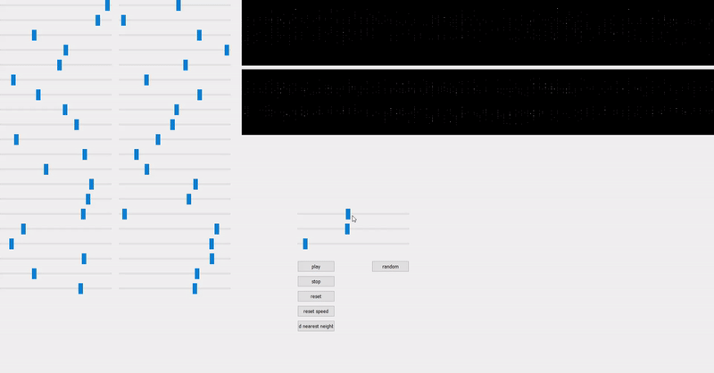

# Autoencoder-midi-generator
GUI Feature: 
The 2 dark stripes are the generated musics. Horizontal axis is time, vertical axis is pitch from 0 to 87 (there are 88 keys on a piano). The color of the pixel means whether a key will be played or not. Black means that key will not be played at that time step; grey means it can be played; white means it is being played. 
There are also sliders and buttons on the GUI, each serves a different purpose.
<figure>

<figcaption>3 sliders on the right. The top one adjusts the threshold of playing a key. Sliding to the left will turn white pixel to grey, meaning it will not be played, and vice versa. The middle slider determines the interval between key presses. Bottom slider determins how long to hold keys.</figcaption>
 

<figcaption>The 20 sliders on the left correspond to the inputs to the generator, they do not directly change the input, instead, they are the top 20 components obtained by reducing the dimension of the input.</figcaption>
 

<figcaption>The "reset" button will set all sliders back to 0, the "random" button will randomize the sliders to generate random music. The button on the bottom is supposed to find "plagiarism" of the music generated, however, as the data size increases, it becomes very expensive to do so, and it is also very unlikely for the generator to completely copy a music from the training data.</figcaption>
</figure>

Uses deep learning to generate midi musics. Trained on about 3000 piano midi files.  
Some samples are under generated_music. Musics generated using bidirectional LSTM are samples 6 and after.  
Really looking forward to use this on my visual novel project XD.  

**Experiments with bidirectional LSTM:** 
Somehow the bidirectional LSTM can produce more interesting results.  
I thought I made a terrible mistake by using the bidirectional layers since I do data augmentation by playing the music normally and backward, and using bidirectional layers may defeat this method. But the results are suprisingly good. 
I have 2 hypotheses: 
1. The sequence is too long (about 1500 ticks) for the network to realize some of them are the reverse of the other. In this case, the model is very likely to behave similarly comparing to models without bidirectional layers. 
2. If the network is able to tell which 2 songs are the reverse of each other, it wll have to remember some long term features, which is benefitial when generating musics.  

I find the second one more convincing, because the loss changes very differently comparing to all previous models, and I observe some structures in the generated muscis, which are not found in previous models without bidirectional layers. 
